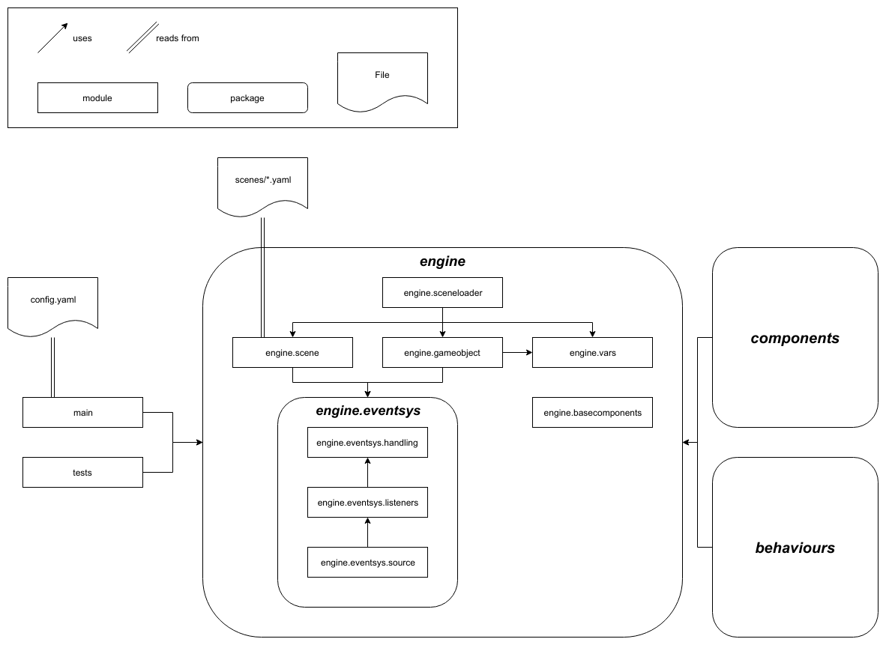

# S2DE docs

## How to read the docs
Most of the documentation for the program is inside the code and can be easily
retrieved in a python interpreter with the `help()` built-in function:
```python
> ### Get info on gameobjects
> import engine # bring the engine into our namespace
> help(engine.gameobjects)
Help on module engine.gameobject in engine:
...
```

In this README is will include only an overview of the program. For in-depth
information you should start reading the docs provided by the help function
(start with the engine module documentation and then delve deeper). However, 
for comodity, I'm going to also leave here a copy of the documentation
divided by topic (for example 'engine-module' and 'gameobjects')

**USERS BE WARNED**: The documentation contained in these files might become
outdated or wrong/lacking. The in-code documentation, however, will always be 
up to date so it's best to consult both, if possible.

## Basic information

### Program structure:


### Event flowchart

